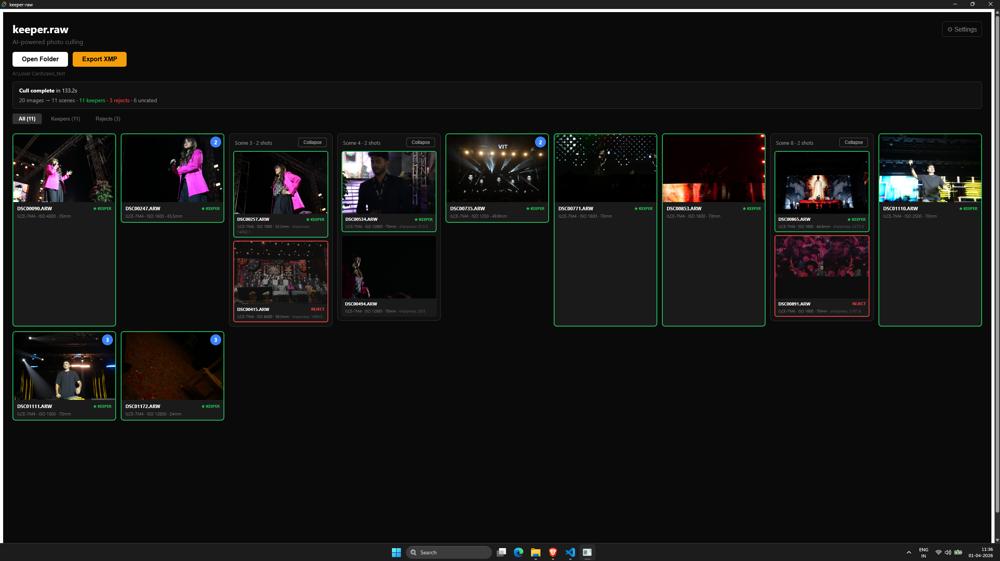

<div align="center">


### AI-powered photo culling. Offline. Open source. Free forever.

[](https://github.com/AtharvVatsal/keeper-raw/actions)
[](LICENSE)
[](#system-requirements)

</div>

---

**keeper.raw** finds the sharpest photo in every burst, flags the blinks, and writes XMP sidecars — so your 3,000-image wedding shoot is ready for Lightroom in minutes, not hours.

No cloud. No subscription. No internet required.



---

## Features

| Feature | Description |
|---|---|
| **Instant Ingest** | Extracts embedded JPEG previews from RAW files — no full decode, no waiting. Supports CR2, CR3, NEF, ARW, RAF, DNG, ORF, RW2. |
| **Smart Stacking** | Groups burst shots into Scenes using timestamp clustering and perceptual hashing. |
| **Tack-Sharp Detection** | Finds the sharpest image in each Scene using eye-region focus scoring with noise-aware normalization. |
| **ZeroBlink Filter** | Detects blinks using facial landmark analysis (Eye Aspect Ratio). Blinkers get flagged automatically. |
| **One-Click Override** | Keyboard shortcuts to override any AI decision: K (keep), X (reject), U (unrate). |
| **XMP Export** | Writes industry-standard `.xmp` sidecar files. Ratings appear instantly in Lightroom, Darktable, and Capture One. |
| **100% Offline** | All AI runs locally on your CPU. No accounts, no uploads, no data harvesting. |

## Quick Start

### Download

Go to the [Releases page](https://github.com/AtharvVatsal/keeper.raw/releases/latest) and download the installer for your platform:

| Platform | Download |
|---|---|
| Windows 10/11 (x64) | `keeper-raw-x.x.x-x64-setup.exe` |
| macOS (Apple Silicon) | `keeper-raw-x.x.x-aarch64.dmg` |
| macOS (Intel) | `keeper-raw-x.x.x-x64.dmg` |
| Linux (AppImage) | `keeper-raw-x.x.x-amd64.AppImage` |
| Linux (Debian/Ubuntu) | `keeper-raw-x.x.x-amd64.deb` |

### Use

1. **Open** keeper.raw
2. **Pick a folder** of RAW files (click "Open Folder" or drag-and-drop)
3. **Click "Cull Images"** — the AI analyzes every photo in seconds
4. **Review** — arrow through Scenes in the loupe view, verify the AI's picks
5. **Override** if needed — press **K** to keep, **X** to reject, **U** to unrate
6. **Click "Export XMP"** — sidecar files appear next to your RAWs
7. **Open Lightroom** — your 5-star keepers and rejects are already flagged

## How It Works

keeper.raw runs a multi-stage computer vision pipeline entirely on your local CPU:

1. **Ingest** — ExifTool extracts the embedded JPEG preview from each RAW file (no full RAW decode needed)
2. **Stack** — Images are grouped into Scenes by timestamp proximity, then sub-split by perceptual hash to catch composition changes
3. **Detect** — YOLOv8-nano (ONNX) locates faces in each preview
4. **Score** — Variance of Laplacian measures sharpness on the detected eye region, normalized for sensor noise
5. **Flag** — MediaPipe Face Mesh computes the Eye Aspect Ratio; if both eyes are below threshold, the image is flagged as a blink
6. **Rank** — The sharpest non-blink image in each Scene becomes the Keeper

All ML models are quantized ONNX format, running via ONNX Runtime on CPU.

## System Requirements

| | Minimum | Recommended |
|---|---|---|
| **OS** | Windows 10 (x64), macOS 12+, Ubuntu 22.04+ | Windows 11, macOS 14+, Ubuntu 24.04 |
| **RAM** | 4 GB | 8 GB+ |
| **CPU** | Any x64 or Apple Silicon | 4+ cores |
| **Disk** | 200 MB for the app | + space for your RAW files |
| **GPU** | Not required | Not used in v0.1 (GPU support planned for v0.2) |
| **Dependencies** | [ExifTool](https://exiftool.org/) must be installed and on your PATH | — |

> **Note:** ExifTool is required for RAW preview extraction. See the [Installation Guide](docs/installation.md) for setup instructions.

## Building from Source

Prerequisites: [Rust](https://rustup.rs/) (stable), [Node.js](https://nodejs.org/) (v18+), [ExifTool](https://exiftool.org/), platform build tools.
```bash
# Clone the repo
git clone https://github.com/AtharvVatsal/keeper.raw
cd keeper.raw

# Install frontend dependencies
npm install

# Download the ONNX models (see models/README.md)
# Place yolov8n-face.onnx and face_landmark.onnx in the models/ directory

# Run in development mode
cargo tauri dev

# Build a release
cargo tauri build
```

See the full [Developer Setup Guide](docs/development.md) for detailed instructions.

## Roadmap

| Version | Focus | Status |
|---|---|---|
| **v0.1.0** | Core culling pipeline + minimal UI + XMP export | Current |
| v0.2.0 | GPU acceleration, additional RAW formats, session persistence | Planned |
| v0.3.0 | Expression analysis, gaze detection, plugin architecture | Planned |
| v0.4.0 | Aesthetic scoring, wildlife/action modes | Planned |
| v1.0.0 | Stable APIs, localization, accessibility | Planned |

## Contributing

Contributions are welcome! Please read the [Contributing Guide](CONTRIBUTING.md) before submitting a PR.

Good first issues are labeled [`good first issue`](https://github.com/AtharvVatsal/keeper.raw/issues?q=is%3Aissue+is%3Aopen+label%3A%22good+first+issue%22) — many are pure TypeScript (UI) or pure Rust (file I/O) and don't require ML knowledge.

## License

This project is licensed under the MIT License — see the [LICENSE](LICENSE) file for details.

## Acknowledgments

keeper.raw is built on the shoulders of these incredible open-source projects:

- [Tauri](https://tauri.app/) — native desktop framework
- [ONNX Runtime](https://onnxruntime.ai/) — cross-platform ML inference
- [YOLOv8](https://github.com/ultralytics/ultralytics) — face detection model
- [MediaPipe](https://mediapipe.dev/) — facial landmark detection
- [ExifTool](https://exiftool.org/) — metadata extraction
- [image_hasher](https://github.com/abonander/img_hash) — perceptual hashing
